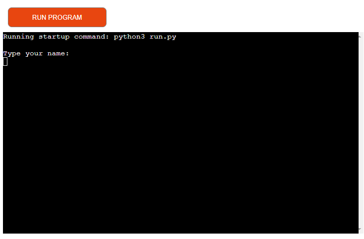
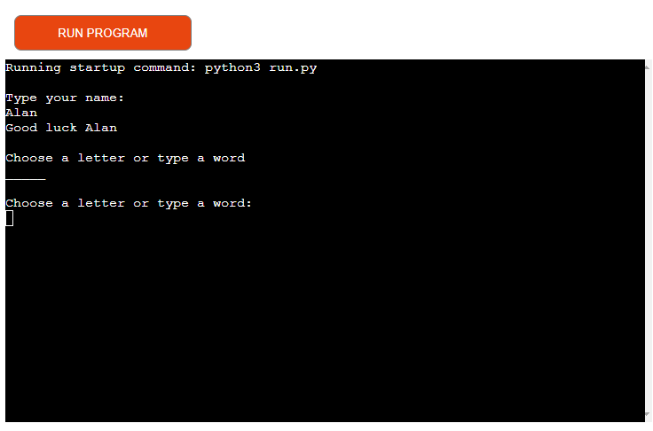
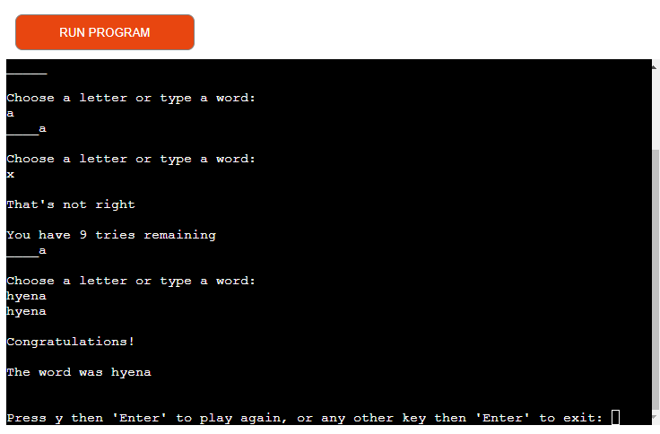

# My Hangman Game

For my third project I have created a version of the popular game 'Hangman'. The player guesses either letter by letter or by inputting the full word until it is correct or they have run out of tries ( a maximum of 10).

This game is targeted towards those who are interested in very simple word activities, or the working of Python.

The live project can be found [here](https://project3--hangman-4b777c3fbb05.herokuapp.com/).

## The Rules

- To start the game you are asked to type your name

- You are then prompted to guess either a letter that may be part of the word, or the whole word at once

- If you guess a letter it will show where in the word that letter belongs

- If you guess the full word you will see the message 'Congratulations! The word was (insert correct word here)

- If you guess incorrectly (up to a maximum of ten times) you will see the warning 'That's not right. You have x tries remaining'

- After you have used all of your attempts you will receive the message 'Better Luck Next Time! The word was (insert correct word here)

- In both scenarios you will be able to either play again by clicking 'y' then Enter, or any other key then Enter to exit the game

 
To explain this further I have included a Flowchart using Lucidchart:

Future Plans

To further improve the user experience in future versions I would limit the guesses (i.e only allow single letters with an appropriate warning if this is not adhered to).
I would also include improved graphics with incorrect guesses resulting in a symbolic body part being added to the hangman's noose as per the classic game

